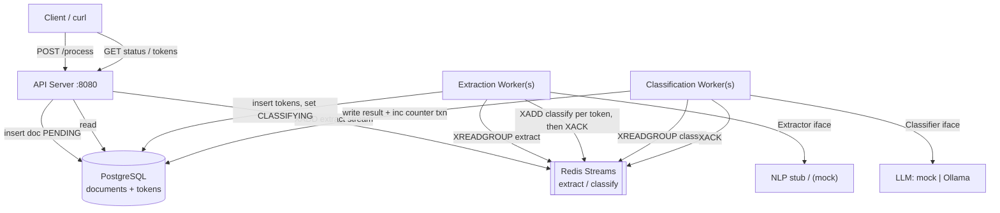

# Plan: Document Processing Pipeline — Senior SWE Home Assignment

## Context

This is a **greenfield** home assignment (`Senior_SWE_Home_Assignment.pdf`): design **and** build a
two-stage document processing pipeline.

- **Extraction**: scans a document → extracts tokens (raw entity snippets) with NLP entity type + position.
- **Classification**: takes each token → classifies into `COMPANY | PERSON | ADDRESS | DATE | UNKNOWN`.

The assignment has three parts plus an explicit deliverables/evaluation list:
1. **Architecture Design** (tech selection, data model, communication contracts + diagram, rerun/recovery, duration tracking).
2. **Trade-offs & Edge Cases** (decision trade-offs, failure scenarios).
3. **Working POC** (clean NLP/LLM interfaces with stubs, per-token storage, rerun support, progress + duration tracking, 3 test docs, 6 demo scenarios, local one-command setup, integration tests).

It must satisfy four cross-cutting requirements: **independent stage scaling, reruns (partial + full), per-document duration tracking, local development**. Evaluation rewards solid justification, resilient design, clean interfaces, working scenarios, and **committed AI prompts**.

### Confirmed decisions (from user)
- **Language**: Go (1.22+), idiomatic, concurrent workers. Aligns with `golang-pro` skill.
- **Transport**: **Redis Streams** (consumer groups) as the message broker between stages; **Postgres remains the single source of truth** for document/token state. Redis gives real production broker semantics — consumer groups, per-message acks (`XACK`), and a Pending Entries List for crash redelivery (`XAUTOCLAIM`) — yet runs as one trivial docker-compose service. Hidden behind a `Queue` interface. The ADR notes **Kafka/NATS as the heavier, higher-throughput evolution** for very large scale, and **Postgres-as-queue** (`SKIP LOCKED`) as the single-dependency alternative we rejected in favor of a real broker.
- **NLP/LLM**: mock stubs by default; **real Ollama classifier** behind the same `Classifier` interface, enabled by env var (`LLM_PROVIDER=ollama`). User has a hosted Ollama API key — no local Ollama process. (Provider is Ollama, not Claude — Claude API skill intentionally not used.)

## Architecture Overview

Three independently-scalable processes; **Redis Streams** for stage hand-off, **Postgres** for durable state:



**Message flow**: API inserts the doc (`PENDING`) in Postgres and `XADD`s an *extract* message. Extraction workers `XREADGROUP` from the `extract` consumer group, run the `Extractor`, upsert tokens to Postgres, `XADD` one *classify* message per token, then `XACK` the extract message. Classification workers `XREADGROUP` from the `classify` group, run the `Classifier`, write result + increment `classified_count` in one Postgres txn, then `XACK`.

**Why this scales independently**: API, extraction workers, and classification workers are separate binaries (separate docker-compose services, independently replicable). Redis consumer groups distribute disjoint messages across N workers per stage with no custom coordinator. The `Queue` interface means the broker is swappable for Kafka/NATS without touching pipeline logic.

**Consistency model**: Postgres is the source of truth; Redis is the transport. Delivery is **at-least-once** (a message may be redelivered after a crash), made safe by **idempotent consumers** — extraction upserts on a unique key, classification skips tokens already `CLASSIFIED`. A lightweight **reconciler** (startup + periodic) re-enqueues any `PENDING` tokens with no in-flight message, closing the gap if a worker crashes between the Postgres write and the `XADD`.

## Data Model (`migrations/0001_init.sql`)

**documents** (manifest / source of truth for state):
- `id TEXT PK`, `text TEXT`, `content_hash TEXT`
- `status` enum: `PENDING → EXTRACTING → CLASSIFYING → COMPLETED` (+ `FAILED`)
- `run_version INT` — fencing token; bumped on full rerun, used to reject stale worker writes
- `total_tokens INT`, `classified_count INT` — progress (`classified_count / total_tokens`)
- `extraction_started_at`, `extraction_completed_at`, `classification_started_at`, `classification_completed_at` (all nullable timestamptz)
- `created_at`, `updated_at`
- locking helper column `locked_at`/`locked_by` (or rely on `FOR UPDATE SKIP LOCKED` on status)

**tokens** (per-token storage):
- `id BIGSERIAL PK`, `document_id TEXT FK`, `run_version INT`
- `text`, `nlp_entity_type` (PERSON/ORG/GPE/DATE), `page INT`, `sentence INT`, `char_offset INT`
- `classification TEXT NULL`, `confidence REAL NULL`, `reasoning TEXT NULL`
- `status` enum: `PENDING → CLASSIFIED`
- `created_at`, `classified_at`
- **UNIQUE (`document_id`, `run_version`, `sentence`, `char_offset`, `text`)** → idempotent extraction upserts (re-extraction after crash is a no-op).
- Indexes: `(document_id, status)` for queue claims, `(document_id, classification)` for token queries.

**How the model satisfies the requirements**:
- *Query by classification/document/page*: indexed columns + `WHERE` filters on `tokens`.
- *Progress*: `classified_count` / `total_tokens` on `documents` (atomic `UPDATE … SET classified_count = classified_count + 1`).
- *Concurrent updates without conflict*: claims via `FOR UPDATE SKIP LOCKED`; counter increments are atomic single-row updates; `run_version` fences stale writes.

Deliverable: typed Go structs in `internal/domain` **and** the SQL schema serve as the schema definitions; a JSON-schema/markdown table mirror lives in `docs/data-model.md`.

## Rerun & Recovery

- **Source of truth**: `documents.status` + per-token `status` in Postgres. Redis only holds in-flight delivery state.
- **Partial rerun (crash recovery)**: two complementary mechanisms. (1) **Redis Streams PEL** — a message a crashed worker never `XACK`ed stays in the consumer group's Pending Entries List; on restart workers reclaim it via `XAUTOCLAIM` (idle-time threshold) and reprocess. (2) **Idempotent consumers** — classification writes the result **and** increments `classified_count` in one Postgres txn, so the "crashed after classify, before `XACK`" case redelivers the message but the token is already `CLASSIFIED` and is skipped (at-least-once compute, exactly-once persistence). Extraction re-run is idempotent via the unique constraint. (3) **Reconciler** backstop re-enqueues `PENDING` tokens lacking an in-flight message (covers a crash between the Postgres write and `XADD`).
- **Full rerun (`POST /process` with `mode=full`)**: in one Postgres transaction — bump `run_version`, delete tokens for the doc, reset counters/timestamps/status to `PENDING`; then re-`XADD` the extract message. Old in-flight workers from the previous version are fenced by `run_version` mismatch on write (their stale `XACK`/results are dropped). No stale artifacts; API only ever serves the current `run_version`.

## Duration Tracking (`docs/duration-tracking.md` + code)

- `extraction_started_at` set when a worker claims the doc (PENDING→EXTRACTING).
- `extraction_completed_at` set when all tokens written (EXTRACTING→CLASSIFYING) — also `classification_started_at` set here.
- `classification_completed_at` set when `classified_count == total_tokens` (→COMPLETED).
- Durations computed at the API/SQL layer: `extraction_completed_at - extraction_started_at`, etc. Status endpoint returns both durations.

## Interfaces (Part 3.1 — contracts first)

`internal/nlp`:
```go
type Extractor interface { Extract(ctx context.Context, doc domain.Document) ([]domain.Entity, error) }
// Entity: Text, Type (PERSON/ORG/GPE/DATE), Page, Sentence, CharOffset
```
`internal/llm`:
```go
type Classifier interface { Classify(ctx context.Context, t domain.Token) (domain.Classification, error) }
// Classification: Category, Confidence, Reasoning
```
- **Mock extractor**: rule-based — capitalized n-gram sequences → PERSON/ORG, regex for dates and street addresses; returns realistic positions. Deterministic.
- **Mock classifier**: maps NLP type → category with light heuristics + plausible confidence/reasoning.
- **Ollama classifier**: calls Ollama chat API (`OLLAMA_BASE_URL`, `OLLAMA_API_KEY`, `OLLAMA_MODEL`) with a concise prompt + **structured JSON output** (`format` schema) → `{category, confidence, reasoning}`. Handles timeouts, retries w/ exponential backoff, rate limits (429); cost-conscious (small context, single-token entity prompt). Selected via `LLM_PROVIDER`.

## Project Structure

```
cmd/{api,extractor,classifier}/main.go   # 3 binaries → independent scaling
internal/
  domain/        # Document, Token, Entity, Classification, status enums
  config/        # env-based config (functional options)
  store/         # Postgres impl: upserts, counters, status transitions, migrations runner
  queue/         # Queue interface + Redis Streams impl (XADD/XREADGROUP/XACK/XAUTOCLAIM); broker-swappable seam
  reconciler/    # re-enqueues PENDING tokens with no in-flight message
  nlp/           # Extractor iface + mock
  llm/           # Classifier iface + mock + ollama
  pipeline/      # extraction & classification worker loops (ctx, graceful shutdown)
  api/           # HTTP handlers (chi or net/http)
migrations/      # 0001_init.sql
testdata/docs/   # small / medium / large test documents
test/            # integration tests (testcontainers-go or dockertest)
docs/            # architecture.md, ADRs, data-model.md, duration-tracking.md, diagrams
prompts/         # committed AI prompts (AI proficiency deliverable)
docker-compose.yml  Dockerfile  Makefile  start.sh  README.md
```

## Documentation Deliverables (`docs/`)

- `architecture.md`: requirements summary, the Mermaid diagram, component responsibilities, communication contracts (REST + queue claim semantics), data-store interactions.
- `tech-selection.md`: the required table — communication = **Redis Streams**, storage = **Postgres**, local dev = **docker-compose** — with justification per the `architecture-designer` skill.
- ADRs (`docs/adr/`): ADR-001 **Redis Streams** as the broker (vs Postgres-as-queue / Kafka / NATS / RabbitMQ — consumer groups + acks + PEL redelivery at near-zero ops cost; Kafka/NATS noted as higher-throughput evolution), ADR-002 Postgres storage (vs NoSQL/blob), ADR-003 separate worker binaries, ADR-004 run_version fencing for full rerun, ADR-005 at-least-once + idempotent consumers + reconciler for the Redis↔Postgres consistency gap.
- `trade-offs.md` (Part 2.1) + `failure-scenarios.md` (Part 2.2): the three required failure cases — classify-before-persist (un-ACKed → PEL redelivery + idempotent skip), extraction mid-crash (un-ACKed extract message + idempotent upsert + reconciler), storage unavailable (handled separately for **Redis down** = no claim/ack, messages retained; and **Postgres down** = txn fails, message not ACKed, redelivered) — mapped to the mechanisms above.
- `data-model.md`, `duration-tracking.md`.

## Test Documents (3, `testdata/docs/`)

- **Small** (5–10 entities): short press-release snippet.
- **Medium** (20–50 entities): news article / Wikipedia excerpt.
- **Large** (100+ entities): long business document — also drives the partial-rerun demo (enough tokens to kill mid-classification).

## Demo & Local Setup

- `start.sh` / `docker-compose up`: Postgres + **Redis** + API + extractor + classifier (workers scalable via `--scale`).
- `Makefile`: `run`, `test`, `demo`, `lint`.
- `scripts/demo.sh` walks all six scenarios with curl:
  1. **Happy path** — POST /process, poll status to COMPLETED, query tokens.
  2. **Progress visibility** — poll `/status` during processing of large doc, show `classified_count/total`.
  3. **Partial rerun** — start large doc, `docker kill` classifier mid-way (un-ACKed messages stay in the Redis PEL), show partial count, restart, `XAUTOCLAIM` redelivers, show completion without re-classifying done tokens.
  4. **Full rerun** — re-POST with `mode=full`, show `run_version` bumped + data replaced.
  5. **Concurrent documents** — POST 3 docs at once, all complete.
  6. **Query** — `/documents/{id}/tokens?classification=PERSON`, by document, by other fields.

API surface (matches PDF examples): `POST /process`, `GET /documents/{id}/status`, `GET /documents/{id}/tokens?classification=`.

## Testing

- **Integration** (`test/`): happy path, partial rerun (crash a worker mid-stream, assert PEL redelivery + resume), full rerun (data replaced + run_version bump), concurrent docs, query filters. Use testcontainers-go for **real Postgres + Redis**.
- **Unit** (table-driven, `-race`): mock extractor/classifier, store upsert/counter/transition logic, queue impl (XADD/XREADGROUP/XACK/XAUTOCLAIM semantics, idempotency), reconciler, Ollama client error/retry handling (httptest server).
- `golangci-lint` + `go vet` clean; race detector on.

## AI Proficiency Deliverable

- `prompts/` directory: commit the prompts used (this planning prompt + key implementation prompts), with a short `prompts/README.md` explaining deliberate, accountable AI usage. Reference it from the main README.

## Implementation Order

1. Scaffold module, `go.mod`, config, domain types, migrations.
2. `store` (Postgres) + `queue` (Redis Streams) + reconciler; unit tests.
3. NLP mock + LLM mock + Ollama classifier; unit tests.
4. Pipeline worker loops (extractor, classifier) with graceful shutdown.
5. API server + handlers.
6. docker-compose, Dockerfile, start.sh, Makefile.
7. Test documents (3) + integration tests + demo script.
8. Docs (architecture, ADRs, tech-selection, trade-offs, failure-scenarios, data-model, duration-tracking) + diagrams.
9. README + prompts/ + final lint/race pass.

## Verification

- `./start.sh` (or `docker-compose up`) brings up Postgres + Redis + all services; `make demo` runs all six scenarios green.
- `make test` runs unit + integration tests with `-race`, all passing.
- `curl` examples from the PDF (process / status / tokens) work verbatim.
- Set `LLM_PROVIDER=ollama` + Ollama env vars → classification uses real Ollama; unset → deterministic mock (evaluator needs no keys).
- `golangci-lint run` clean.
