# Architecture — Document Processing Pipeline

## 1. Problem & Requirements

The system processes documents in two stages:

| Stage | Purpose |
|-------|---------|
| **Extraction** | Scan a document and emit *tokens* — raw text snippets that might be entities — each with its position and surrounding sentence (context). It does not label them. |
| **Classification** | Take each token and classify it into a business category: `COMPANY`, `PERSON`, `ADDRESS`, `DATE`, `UNKNOWN`. |

The design must address four cross-cutting requirements:

1. **Independently scalable stages** — extraction, classification, and API serving must scale separately.
2. **Reruns** — resume after partial failure (crash recovery) *and* fully reprocess a document from scratch.
3. **Duration tracking** — measure extraction and classification time per document.
4. **Local development** — an engineer can run and test the whole system locally.

Non-functional priorities: correctness under concurrency and crashes (no lost or double-counted work), operational simplicity, and clean interfaces around the (mockable) NLP/LLM components.

## 2. High-Level Architecture

> Diagram best viewed on [mermaidviewer.com](https://mermaidviewer.com/).

Three independently deployable processes share two backing services: **Postgres** (durable state / source of truth) and **Redis Streams** (the message broker between stages).

The numbers on the edges below are the order of operations for one document. The
**relay** (steps 3–4) runs continuously for *every* outbox row — first the extract
message written in step 2, then the per-token classify messages written in step 7
— so steps 3–4 recur before step 9. Dashed edges are the independent read/query
path.

```mermaid
---
config:
  layout: elk
  flowchart:
    nodeSpacing: 60
    rankSpacing: 90
---
graph TD
    Client["Client / curl"] -->|"1 · POST /process"| API["API Server :8080"]
    API -->|"2 · insert doc + extract msg (one txn)"| DB[("PostgreSQL&#10;documents + tokens + outbox")]

    RELAY["Outbox Relay (in API process)"] -->|"3 · claim outbox rows"| DB
    RELAY -->|"4 · XADD msg, then delete row"| RS[["Redis Streams&#10;extract / classify"]]

    EW["Extraction Worker(s)"] -->|"5 · XREADGROUP extract"| RS
    EW -->|"6 · Extractor interface"| NLP["NLP: mock stub"]
    EW -->|"7 · insert tokens + classify msgs,&#10;set CLASSIFYING (one txn)"| DB
    EW -->|"8 · XACK extract"| RS

    CW["Classification Worker(s)"] -->|"9 · XREADGROUP classify"| RS
    CW -->|"10 · Classifier interface"| LLM["LLM: mock | Ollama"]
    CW -->|"11 · write result + inc counter (one txn)"| DB
    CW -->|"12 · XACK classify"| RS

    Client -.->|"GET status / tokens"| API
    API -.->|"read"| DB
```



**Message flow (transactional outbox)**: producers never publish to Redis directly.
**(1–2)** the API inserts the document **and** the *extract* message into the
`outbox` table in one transaction. **(3–4)** the relay drains outbox rows, `XADD`s
them to Redis, and deletes them. **(5–8)** an extraction worker reads the extract
message, runs the `Extractor`, then in **one transaction** upserts tokens, advances
the document to `CLASSIFYING`, and writes one *classify* outbox row per token, then
`XACK`s. The relay (3–4 again) publishes those classify rows. **(9–12)** a
classification worker reads a classify message, runs the `Classifier`, writes the
result + increments `classified_count` in one txn, then `XACK`s. Because each state
change and its message commit together, there is no write-then-publish gap.

### Components & responsibilities

| Component | Responsibility | Scales by |
|-----------|----------------|-----------|
| **API server** (`cmd/api`) | Accept documents (writing the doc + first extract message to the outbox in one txn), serve status & token queries. Hosts the outbox relay. | Stateless — run N replicas behind a load balancer. |
| **Outbox relay** (in `cmd/api`) | Drain the `outbox` table and publish messages to Redis. The single, reliable publisher. | Can move to its own deployment; `FOR UPDATE SKIP LOCKED` lets relays share the outbox. |
| **Extraction worker** (`cmd/extractor`) | Consume `extract` jobs, run the NLP `Extractor`, and in one txn persist tokens + write one `classify` outbox row per token. | Add replicas; the Redis consumer group load-balances documents. |
| **Classification worker** (`cmd/classifier`) | Consume `classify` jobs, run the LLM `Classifier`, persist the result and advance progress atomically. | Add replicas; the consumer group load-balances tokens. |
| **Postgres** | Source of truth for document & token state, progress counters, stage timestamps, and the outbox. | Read replicas / partitioning (out of scope for the POC). |
| **Redis Streams** | At-least-once transport with consumer groups, acks, and crash redelivery (PEL). | Redis Cluster / stream sharding (out of scope for the POC). |

**Why this supports independent scaling:** the three processes are separate binaries with no in-process coupling — they communicate only through Postgres and Redis. A backlog of classification work (the expensive LLM stage) is absorbed by scaling *only* `classifier` replicas; the consumer group distributes disjoint tokens to each with no custom coordinator. The API never blocks on processing, so it scales with request load, not throughput.

### Code layering (within a process)

Each binary is built from layered packages with one direction of dependency:

| Layer | Package(s) | Responsibility |
|-------|-----------|----------------|
| **Transport** | `internal/api` | HTTP handlers + DTOs. Parse request, call a service, render a response. No business or persistence logic. |
| **Application / service** | `internal/service` (API path), `internal/pipeline` (stage workers) | Business decisions and orchestration: the submit decision tree, whether to enqueue, the extract→save→fan-out flow. Talks to the store and the broker. |
| **Repository** | `internal/store` | Persistence only. Atomic operations on documents/tokens; returns *data, not directives*. A Unit-of-Work (`store.WithinTx` + `store.Tx`) lets the service compose a multi-step decision in one transaction without the store owning the decision. |
| **Domain** | `internal/domain` | Core types, states, and invariants shared by all layers. |

This keeps the persistence layer free of application concerns (e.g. the store never decides whether to publish a job — the service does) and keeps handlers thin.

## 3. Communication Contracts

### 3.1 HTTP API (client ⇄ API server)

| Method & path | Purpose | Body / query | Response |
|---|---|---|---|
| `POST /process` | Submit a document or trigger a rerun | `{"document_id","text","mode"?}` where `mode` ∈ `partial` (default) \| `full` | `202` `{"document_id","status","run_version","accepted","message"}` |
| `GET /documents/{id}/status` | Progress, state, durations | — | `200` status object (see below) |
| `GET /documents/{id}/tokens` | Query tokens | `?classification=&status=&page=&limit=&offset=` | `200` `{"document_id","count","tokens":[…]}` |
| `GET /healthz` | Liveness/readiness | — | `200` / `503` |

Status response shape:

```json
{
  "document_id": "doc-123",
  "status": "COMPLETED",
  "run_version": 1,
  "progress": { "classified": 140, "total": 140, "percent": 100 },
  "durations": { "extraction_seconds": 0.01, "classification_seconds": 6.57 },
  "timestamps": { "extraction_started_at": "…", "extraction_completed_at": "…",
                  "classification_started_at": "…", "classification_completed_at": "…" }
}
```

### 3.2 Broker messages (stage ⇄ stage)

Messages are JSON payloads on two streams. Contracts live in `internal/pipeline/jobs.go`.

```jsonc
// stream "pipeline:extract", group "extractors"
{ "document_id": "doc-123", "run_version": 1 }

// stream "pipeline:classify", group "classifiers"
{ "token_id": 42, "document_id": "doc-123", "run_version": 1 }
```

The `run_version` travels with every message so workers can detect and drop writes from a superseded run (see [Rerun & Recovery](rerun-and-recovery.md)).

### 3.3 Compute interfaces (worker ⇄ NLP/LLM)

```go
// internal/nlp — returns untyped candidate tokens: text, context (the sentence),
// and position (sentence + rune offset). Extraction does NOT label entities.
type Extractor interface {
    Extract(ctx context.Context, doc domain.Document) ([]domain.Entity, error)
}
// internal/llm — receives the token's text AND its context, and is the ONLY
// stage that assigns a category, with confidence + reasoning.
type Classifier interface {
    Classify(ctx context.Context, tok domain.Token) (domain.Classification, error)
}
```

These are the seams where mocks (default) or real services (Ollama for classification) plug in without touching pipeline code. Per the assignment's example flow, extraction emits *tokens (text + context + position)* with **no entity type**, and classification consumes *entity text + context* (the surrounding sentence, captured at extraction and carried on the token) and returns *category + confidence/reasoning*. Labeling lives entirely in the classifier.

## 4. Data Store Interactions

- **Postgres is the single source of truth.** Every durable decision — a token created, a token classified, progress advanced, a stage timestamp set — is a Postgres write, most inside a transaction.
- **Redis holds only in-flight delivery state.** Messages originate in the Postgres `outbox`, written in the same transaction as the state change that produced them; the relay publishes them. If Redis were wiped, undelivered outbox rows would simply be (re)published.
- There is **no write-then-publish gap**: a state change and its message commit atomically, so the system never has durable state without the message to advance it. The **transactional outbox** is what guarantees this (see [ADR-005](adr/ADR-005-consistency-model.md)).

## 5. Related Documents

- [Technology Selection](tech-selection.md) — choices and justification.
- [Data Model](data-model.md) — schema and how it answers the required queries.
- [Rerun & Recovery](rerun-and-recovery.md) — partial and full reruns, source of truth.
- [Duration Tracking](duration-tracking.md) — timestamps and how durations are computed.
- [Trade-off Analysis](trade-offs.md) — alternatives considered and what we gave up.
- [Failure Scenarios](failure-scenarios.md) — how the design handles specific failures.
- [ADRs](adr/) — the key decisions, recorded.
