# Architecture — Document Processing Pipeline

## 1. Problem & Requirements

The system processes documents in two stages:

| Stage | Purpose |
|-------|---------|
| **Extraction** | Scan a document and emit *tokens* — raw text snippets that might be entities — each with an NLP entity type and a position. |
| **Classification** | Take each token and classify it into a business category: `COMPANY`, `PERSON`, `ADDRESS`, `DATE`, `UNKNOWN`. |

The design must address four cross-cutting requirements:

1. **Independently scalable stages** — extraction, classification, and API serving must scale separately.
2. **Reruns** — resume after partial failure (crash recovery) *and* fully reprocess a document from scratch.
3. **Duration tracking** — measure extraction and classification time per document.
4. **Local development** — an engineer can run and test the whole system locally.

Non-functional priorities: correctness under concurrency and crashes (no lost or double-counted work), operational simplicity, and clean interfaces around the (mockable) NLP/LLM components.

## 2. High-Level Architecture

Three independently deployable processes share two backing services: **Postgres** (durable state / source of truth) and **Redis Streams** (the message broker between stages).

```mermaid
graph TD
    Client["Client / curl"] -->|"POST /process"| API["API Server :8080"]
    Client -->|"GET status / tokens"| API
    API -->|"insert doc PENDING"| DB[("PostgreSQL&#10;documents + tokens")]
    API -->|"read"| DB
    API -->|"XADD extract"| RS[["Redis Streams&#10;extract / classify"]]

    EW["Extraction Worker(s)"] -->|"XREADGROUP extract"| RS
    EW -->|"Extractor interface"| NLP["NLP: mock stub"]
    EW -->|"upsert tokens, set CLASSIFYING"| DB
    EW -->|"XADD classify (per token), XACK"| RS

    CW["Classification Worker(s)"] -->|"XREADGROUP classify"| RS
    CW -->|"Classifier interface"| LLM["LLM: mock | Ollama"]
    CW -->|"write result + inc counter (txn)"| DB
    CW -->|"XACK"| RS

    REC["Reconciler (in API process)"] -->|"find orphaned work"| DB
    REC -->|"re-XADD"| RS
```



### Components & responsibilities

| Component | Responsibility | Scales by |
|-----------|----------------|-----------|
| **API server** (`cmd/api`) | Accept documents, publish the first extract job, serve status & token queries. Hosts the reconciler. | Stateless — run N replicas behind a load balancer. |
| **Extraction worker** (`cmd/extractor`) | Consume `extract` jobs, run the NLP `Extractor`, persist tokens, fan out one `classify` job per token. | Add replicas; the Redis consumer group load-balances documents. |
| **Classification worker** (`cmd/classifier`) | Consume `classify` jobs, run the LLM `Classifier`, persist the result and advance progress atomically. | Add replicas; the consumer group load-balances tokens. |
| **Postgres** | Source of truth for document & token state, progress counters, and stage timestamps. | Read replicas / partitioning (out of scope for the POC). |
| **Redis Streams** | At-least-once transport with consumer groups, acks, and crash redelivery (PEL). | Redis Cluster / stream sharding (out of scope for the POC). |

**Why this supports independent scaling:** the three processes are separate binaries with no in-process coupling — they communicate only through Postgres and Redis. A backlog of classification work (the expensive LLM stage) is absorbed by scaling *only* `classifier` replicas; the consumer group distributes disjoint tokens to each with no custom coordinator. The API never blocks on processing, so it scales with request load, not throughput.

## 3. Communication Contracts

### 3.1 HTTP API (client ⇄ API server)

| Method & path | Purpose | Body / query | Response |
|---|---|---|---|
| `POST /process` | Submit a document or trigger a rerun | `{"document_id","text","mode"?}` where `mode` ∈ `partial` (default) \| `full` | `202` `{"document_id","status","run_version","accepted","message"}` |
| `GET /documents/{id}/status` | Progress, state, durations | — | `200` status object (see below) |
| `GET /documents/{id}/tokens` | Query tokens | `?classification=&type=&status=&page=&limit=&offset=` | `200` `{"document_id","count","tokens":[…]}` |
| `GET /healthz` | Liveness/readiness | — | `200` / `503` |

Status response shape:

```json
{
  "document_id": "doc-123",
  "status": "COMPLETED",
  "run_version": 1,
  "progress": { "classified": 140, "total": 140, "percent": 100 },
  "durations": { "extraction_seconds": 0.01, "classification_seconds": 6.57 },
  "timestamps": { "extraction_started_at": "…", "extraction_completed_at": "…",
                  "classification_started_at": "…", "classification_completed_at": "…" }
}
```

### 3.2 Broker messages (stage ⇄ stage)

Messages are JSON payloads on two streams. Contracts live in `internal/pipeline/jobs.go`.

```jsonc
// stream "pipeline:extract", group "extractors"
{ "document_id": "doc-123", "run_version": 1 }

// stream "pipeline:classify", group "classifiers"
{ "token_id": 42, "document_id": "doc-123", "run_version": 1 }
```

The `run_version` travels with every message so workers can detect and drop writes from a superseded run (see [Rerun & Recovery](rerun-and-recovery.md)).

### 3.3 Compute interfaces (worker ⇄ NLP/LLM)

```go
// internal/nlp
type Extractor interface {
    Extract(ctx context.Context, doc domain.Document) ([]domain.Entity, error)
}
// internal/llm
type Classifier interface {
    Classify(ctx context.Context, tok domain.Token) (domain.Classification, error)
}
```

These are the seams where mocks (default) or real services (Ollama for classification) plug in without touching pipeline code.

## 4. Data Store Interactions

- **Postgres is the single source of truth.** Every durable decision — a token created, a token classified, progress advanced, a stage timestamp set — is a Postgres write, most inside a transaction.
- **Redis holds only in-flight delivery state.** If Redis were wiped, no committed work would be lost; the reconciler would re-enqueue everything still `PENDING` from Postgres.
- The only place the two systems can disagree is the instant between a Postgres write and the matching Redis `XADD`. The **reconciler** closes that gap (see [ADR-005](adr/ADR-005-consistency-model.md)).

## 5. Related Documents

- [Technology Selection](tech-selection.md) — choices and justification.
- [Data Model](data-model.md) — schema and how it answers the required queries.
- [Rerun & Recovery](rerun-and-recovery.md) — partial and full reruns, source of truth.
- [Duration Tracking](duration-tracking.md) — timestamps and how durations are computed.
- [Trade-off Analysis](trade-offs.md) — alternatives considered and what we gave up.
- [Failure Scenarios](failure-scenarios.md) — how the design handles specific failures.
- [ADRs](adr/) — the key decisions, recorded.
